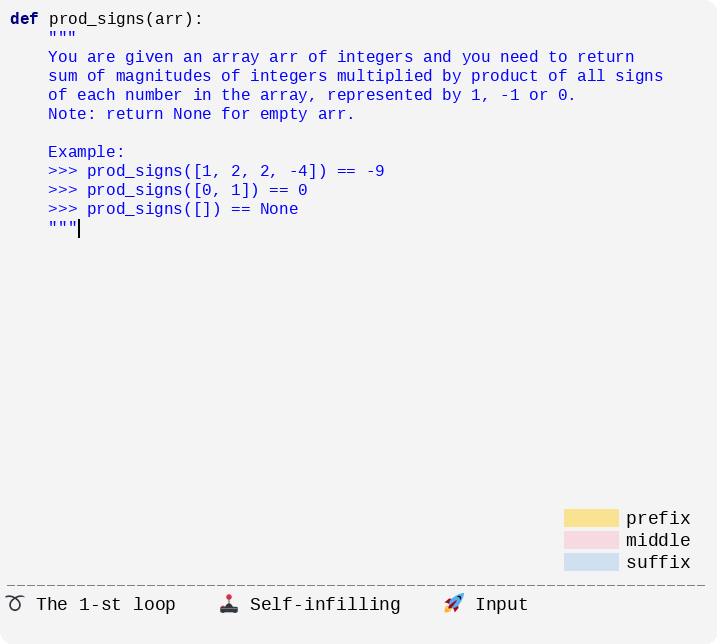
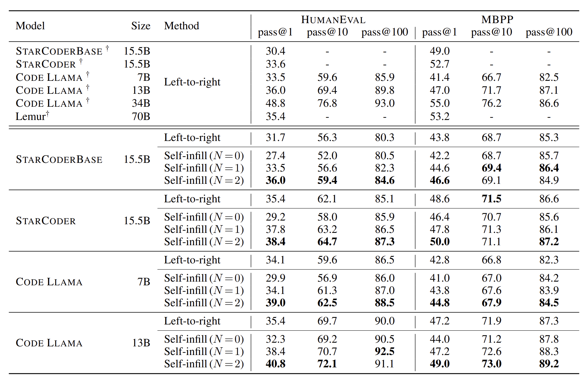

# Self-infilling Code Generation

<p align="center">
  
</p>

This repository contains the official implementation of paper [Self-Infilling Code Generation](https://arxiv.org/abs/2311.17972). Self-infilling offers an alternative approach for code generation, allowing for **interrupting** the decoding of uncertain contexts and crafting a definitive suffix first. The suffix is initiated with a `suffix prompt` to scaffold the overall generation, and the language model then works backward to complete the code by filling in the middle. Besides, self-infilling further facilitates a **looped decoding** procedure, which iteratively updates and synchronizes each piece of generation in a cyclic manner. 

## Setup

Our codebase builds upon [bigcode-evaluation-harness](https://github.com/bigcode-project/bigcode-evaluation-harness). Use the following steps to set up the codebase:

1. Create and activate a virtual Python environment:

    ```bash
    python3 -m venv envs/si_gen
    source envs/si_gen/bin/activate
    ```

2. Clone the repository and install dependencies:

    ```bash
    git clone https://github.com/LZhengisme/self-infilling.git
    cd self-infilling

    # or use a different Pytorch/CUDA version.
    pip install torch==2.1.0+cu121 --index-url https://download.pytorch.org/whl/cu121

    pip install -e .
    ```

3. Configure `accelerate` for multi-GPU code generation:

    ```bash
    accelerate config
    ```

4. For `DS-1000` tasks that require designated versions of Python packages, we recommend using a separate virtual environment for **evaluation**:

    ```bash
    python3 -m venv envs/si_eval
    source envs/si_eval/bin/activate

    cd self-infilling

    # torch==1.12.1 required for **EVALUATING** ds-1000. Download version with relevant GPU support etc., e.g.,
    pip install torch==1.12.1
    # addition options are required for the DS-1000 benchmark
    pip install -e ".[ds1000]"
    ```

## Usage

### Demo 🚀

Use `example.py` to try out our demo for self-infilling generation. We have implemented the core functionality of self-infilling as a Huggingface `LogitsProcessor` and `StoppingCriteria`, making it straightforward to invoke self-infilling via the vanilla HF generation interface with a few extra lines of configuration code:

```python
# load your model and tokenizer, etc.
... 

gen_kwargs = {
    # common generation arguments
    "do_sample": True,
    "temperature": 0.2,
    "top_p": 0.95,
    "max_new_tokens": 128,

    # self-infilling configuration
    "stopping_criteria": StoppingCriteriaList([
        SelfInfillEndOfFunctionCriteria(
          0, stop_words, tokenizer
        )
    ]),
    "logits_processor": LogitsProcessorList([
        SelfInfillingLogitsProcessor(
            0, stop_words, tokenizer, 
            tau=args.self_infill_tau,
            suffix_prompt=suffix_prompt
        )
    ])
}

# use HF's generation interface
si_generated_tokens = model.generate(
    input_ids=input_ids, 
    attention_mask=attention_mask,
    **gen_kwargs,
)

...
```

We provide an example input prompt and suffix prompt in `example_prompt.txt` and `example_suffix_prompt.txt`, respectively. Running the following command would generate a completion via self-infilling that tries to connect the given suffix prompt:

```bash
python3 example.py --model codellama/CodeLlama-7b-hf --self-infill-tau 0.25 --prompt-file example_prompt.txt --suffix-prompt-file example_suffix_prompt.txt
```

<details>
  <summary>Click to expand the sample output</summary>

Here `<PRE>`, `<SUF>`, and `<MID>` indicate the start of the prefix, the suffix, and the middle, respectively; `<EOT>` denotes the end of the infilled middle section.

```bash
######################################################
# Sample input:
<PRE>Train a logistic regression model, predict the labels on the test set and compute the accuracy score:

<code>
X_train, y_train, X_test, y_test = train_test_split(X, y, test_size=0.1)

# Sample suffix prompt:
def compute_accuracy

######################################################
# Sample output:
<SUF>def compute_accuracy(y_test, y_pred):
    return np.mean(y_test == y_pred)

accuracy = compute_accuracy(y_test, y_pred)
print(accuracy)
</code><MID>
logreg = LogisticRegression()
logreg.fit(X_train, y_train)
y_pred = logreg.predict(X_test)

<EOT>
```
</details>

- Check out `example.py` for details about processing self-infilling's inputs and outputs.

- Our full implementation of self-infilling, including the looping mechanism introduced in our paper, can be found at `lm_eval/generation_pipelines/self_infill_utils.py`.

- It is worth noticing that sometimes (self-)infilling may fail to complete the procedure (e.g., it might produce a poor suffix or struggle to generate a coherent middle given the prefix and suffix). This issue is not uncommon in infill-capable language models, and we recommend following previous practices to resolve this, such as re-sampling the generation until a satisfactory result is obtained (e.g., see the [example usage of Incoder](https://github.com/dpfried/incoder/blob/main/example_usage.py)).

### Task Evaluation
We evaluated self-infilling generation across several code benchmarks including HumanEval, MBPP, DS-1000, and GSM8K. For detailed results and analyses, please refer to the table below as well as our paper.

<p align="center">
  
</p>

Run our entry script `launch.sh` for conducting code generation tasks evaluated in our paper:

```bash
# [optional] set your HF user access token here if needed
# e.g., load private/gated models
# see https://huggingface.co/docs/hub/security-tokens
export HF_TOKEN="hf_..."

# [optional] activate your virtual environment here
# for **evaluating** DS-1000 tasks
source envs/si_eval/bin/activate

bash launch.sh -r <RUN_MODE> \
    -d <DATASET> \
    -b <BATCH_SIZE> \
    -m <MODEL> \
    -s <SAVE_DIR> \
    -g <GENERATE_MODE> \
    -p <NUM_PROCESSES> \
    -e True \
    --use_self_infill <ENABLE_SELF_INFILL_OR_NOT> \
    ...
```

We provide detailed instructions for each option in `launch.sh`. To reproduce our experimental results on different tasks, execute `run.sh` and specify the task name as the argument. For example: 

```bash
# Feel free to explore and modify parameters in `run.sh` as needed.
bash run.sh humaneval
bash run.sh mbpp
bash run.sh ds1000-all-completion
bash run.sh pal-gsm8k
```

## Citation

If you find our work helpful, please cite:

```bibtex
@article{zheng2023self,
  title={Self-Infilling Code Generation},
  author={Zheng, Lin and Yuan, Jianbo and Zhang, Zhi and Yang, Hongxia and Kong, Lingpeng},
  journal={arXiv preprint arXiv:2311.17972},
  year={2023}
}
```
